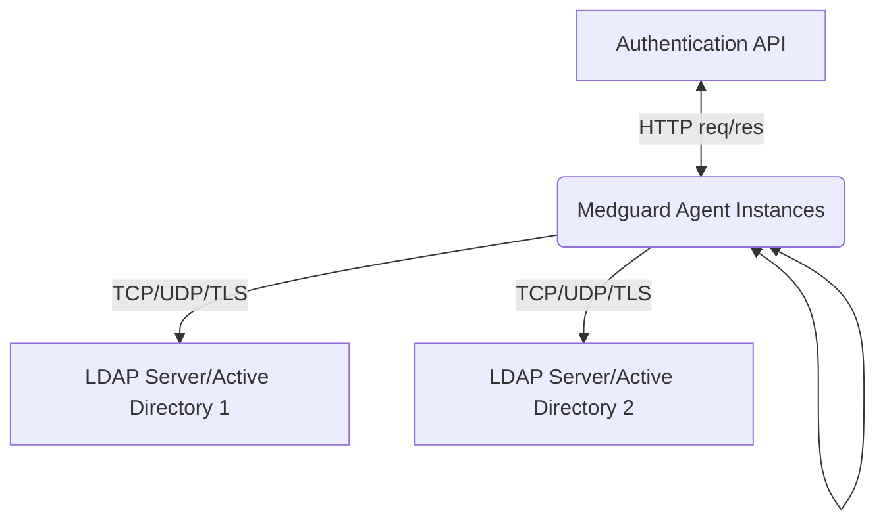

# Medguard Systems

## Authentication Documentation
Medguard Systems provides credentialing and authentication products for
diagnostic providers.  This documentation outlines general technical
details for the Authentication API and the on-premise software
toolkit Medguard Agent.

## Authentication API
Our cloud identity provider (IdP) service exposes a set of endpoints
that Medguard Agent interacts with during an authentication event.

These endpoints can be found [here](https://www.google.com).

Please note that endpoints should not ordinarily be accessed directly
by providers.

## Medguard Agent
Our on-premise software is designed to be simple to configure and
customised for individual use cases. The documentation presented here
represents a general use case. [Contact
us](https://www.medguard.io/#contact-us-section) to discuss how we can
customise Medguard Agent to fit your existing infrastructure
requirements.


### High-Level Explanation



Medguard Agent is performing 3 distinct functions:
1. HTTP client interacting with IdP endpoints,
2. LDAP proxy / client / server endpoints,
3. Coordination of state across Medguard Agent Instances.

At a high level Medguard Agent is a function that maps a traditional
HTTP OAuth flow onto authentication in an LDAP setting.


### Configuration

Medguard Agent is easily configured using a TOML file.
On launch of the executable, the configuration flag is passed.


```console
foo@bar:~$ medguard-agent -c /path/to/config.toml
```

or

```console
C:\> medguard-agent -c /path/to/config.toml
```

